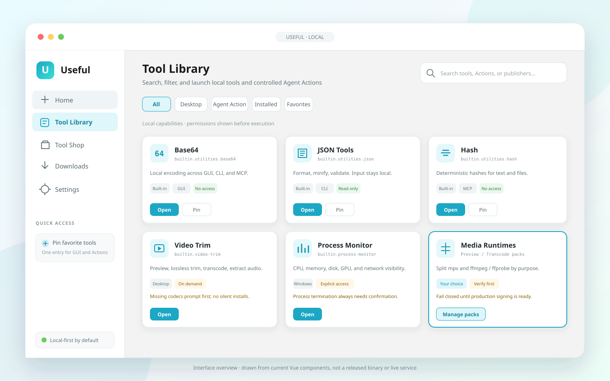

# Useful

[简体中文](README.zh-CN.md) · English

Useful is a desktop application that runs tools on the local computer. It groups tasks that often
need separate browser tabs, command snippets, or small programs.

Useful includes:

- 31 standalone developer utilities (36 built-in Actions with the Office groups)
- local Office file operations with fixed limits
- video trim and convert
- Windows process inspection
- a signed package format for third-party tools

The stack is Vue 3, Tauri 2, and Rust.

Unless a feature requires the network, tool input stays on the device. Useful does not include an
AI model. Useful does not change the configuration of Codex, Claude, or other Agent hosts.

> [!IMPORTANT]
> Useful is a developer preview. Official **signed** installers and a production
> update feed are not available. An **unsigned** Windows desktop preview is on the
> [v0.1.0-beta.10](https://github.com/RedeatI/useful/releases/tag/v0.1.0-beta.10) release
> (portable zip preferred). Windows is the main development platform. Some native
> features do not work on macOS or Linux. Read
> [Known limitations](docs/KNOWN-LIMITATIONS.en.md).

## Choose your path

| You want to… | Start here |
| --- | --- |
| Try the Windows desktop app | [Download the unsigned preview](#download-unsigned-windows-preview) |
| Connect an Agent host | [CLI and MCP](#cli-and-mcp) |
| Build a third-party tool | [Agent tool guide](docs/agent/BUILD-A-TOOL.en.md) |
| Build or contribute to Useful | [Run from source](#run-from-source) · [Contributing](CONTRIBUTING.md) |



### Download (unsigned Windows preview)

Release: [v0.1.0-beta.10](https://github.com/RedeatI/useful/releases/tag/v0.1.0-beta.10)

**Preferred: portable zip**

1. Download `Useful-0.1.0-beta.10-windows-x64-portable-lite.zip`
2. Extract the archive
3. Open the nested folder `Useful`
4. Run `Useful.exe` (keep `portable.flag` next to it)
5. App data is written under `Useful\data\`

Optional: `Useful-0.1.0-beta.10-windows-x64-setup-lite.exe`.
Windows SmartScreen may warn. These builds are **not** Authenticode-signed production packages.

Verify the portable archive against `SHA256SUMS.txt` from the same release:

```powershell
$asset = "Useful-0.1.0-beta.10-windows-x64-portable-lite.zip"
$expected = ((Select-String -Path .\SHA256SUMS.txt -Pattern ([regex]::Escape($asset) + '$')).Line -split '\s+')[0].ToLowerInvariant()
$actual = (Get-FileHash ".\$asset" -Algorithm SHA256).Hash.ToLowerInvariant()
if ($actual -ne $expected) { throw "SHA-256 mismatch for $asset" }
```

Report reproducible bugs through [GitHub Issues](https://github.com/RedeatI/useful/issues). For a
security vulnerability, follow [SECURITY.md](SECURITY.md) instead of opening a public issue.

## Features

- **Utilities** — Format JSON. Encode and decode Base64 and URL data. Compute hashes. Create UUIDs
  and timestamps. Test regular expressions. Convert JSON and YAML. Diff text. Inspect IPv4/CIDR.
  Convert units. Edit colors. These tools work offline by default.
- **Office files** — Create, inspect, and extract DOCX and PPTX. Convert simple Markdown to and from
  documents or slides. Inspect and convert XLSX, CSV, and simple Markdown tables. Inspect, merge,
  split, extract, delete, reorder, rotate, or clean PDF pages. These tools are not a full Office
  editor.
- **Video** — Inspect media. Trim without re-encode when the format allows. Transcode a time range.
  Extract audio. Cancel a long job.
- **Process monitor (Windows)** — Show CPU, memory, disk, GPU, and network use. The first release is
  read-only. End-process and one-click elevation are disabled. To run with administrator rights, exit
  Useful, then start Useful as administrator from Windows.
- **Tool library** — Search, pin, and mark built-in and installed tools as favorites.
- **Extensions** — Validate and pack web tools as `.useful` archives. Verify a tool publisher's
  package signature during a trusted install. This is separate from the Windows app's Authenticode
  signature status. Host a compatible package source.
- **Agent access** — Call 36 built-in Actions through a JSON command-line interface (CLI) or a local
  stdio Model Context Protocol (MCP) server. An Agent profile can hide Actions that a host must not
  see.

The interface supports Simplified Chinese and English (US). Light and dark themes are available.

On Windows, portable mode writes data to `./data` next to `Useful.exe` when the file `portable.flag` exists. Without that file, data goes to `%APPDATA%\Useful`. Do not delete `portable.flag` if you want the portable layout.

## Run from source

Install:

- Node.js `^20.9.0` or `>=22.0.0`
- pnpm 9.15.0
- the stable Rust toolchain
- the [Tauri 2 prerequisites](https://v2.tauri.app/start/prerequisites/) for your platform

Then run:

```console
git clone https://github.com/RedeatI/useful.git
cd useful
pnpm install --frozen-lockfile
pnpm tauri dev
```

`pnpm dev` starts only the web frontend. Use it for interface work. Media, process, and other native
features need the Tauri application. In web-only mode, Useful reports that the native backend is not
available.

A release-profile build stops if production update-trust settings are missing. For a local
release-style quality-assurance (QA) build, follow
[Developer preview](docs/DEVELOPER-PREVIEW.en.md). Do not publish those QA files as official
binaries.

## CLI and MCP

The default Action registry holds **36 Actions**:

- 31 utilities listed in [Tool Actions](docs/TOOL-ACTIONS.en.md)
- 5 Office Action groups:

```text
builtin.office.docx
builtin.office.pptx
builtin.office.spreadsheet
builtin.office.pdf
builtin.office.markdown
```

Query the registry. Do not hard-code Action IDs:

```console
node packages/useful-runtime/bin/useful-runtime.mjs actions search --query office --category office --json
node packages/useful-runtime/bin/useful-runtime.mjs actions describe builtin.office.docx --json
node packages/useful-runtime/bin/useful-runtime.mjs actions suggest --input @sample.txt --limit 5 --json
node packages/useful-runtime/bin/useful-runtime.mjs actions recipe --input @examples/action-recipes/json-base64.json --output json
```

Show the machine-readable CLI contract:

```console
pnpm useful -- agent-contract --json
```

### Connect an Agent host (review only)

Create a host-specific MCP stdio configuration candidate. These commands do not write host
configuration files:

```console
pnpm useful -- agent plan --target codex --launcher /ABS/PATH/useful-mcp.mjs --json
pnpm useful -- agent export --target claude-code --launcher /ABS/PATH/useful-mcp.mjs --json
pnpm useful -- agent doctor --target claude-desktop --launcher /ABS/PATH/useful-mcp.mjs --json
```

Valid targets: `codex`, `claude-code`, `claude-desktop`, `mcp-servers-json`.

Run a local self-check, or bind a candidate to the current installation:

```console
pnpm useful -- agent probe --json
pnpm useful -- agent verify --target codex --launcher /ABS/PATH/packages/useful-mcp/bin/useful-mcp.mjs --json
pnpm useful -- agent verify-all --launcher /ABS/PATH/packages/useful-mcp/bin/useful-mcp.mjs --json
```

If you use an Agent Kit from a GitHub Release, extract the kit, then run:

```console
# Windows
C:\ABS\KIT\bin\useful.cmd agent verify-all --launcher C:\ABS\KIT\lib\useful-mcp.mjs --json

# macOS / Linux
/ABS/KIT/bin/useful agent verify-all --launcher /ABS/KIT/lib/useful-mcp.mjs --json
```

In Settings, open **Agent Connections**. Paste only JSON that you create with `verify-all` in a
terminal. The page does not start a subprocess. The page does not rewrite host configuration.

### Limits of these commands

- The commands do not write Codex, Claude, or Claude Desktop configuration files.
- The commands do not install those hosts.
- The commands do not prove that a host is installed or that the host will accept the candidate.
- Results from `probe`, `verify`, and `verify-all` describe the current process and local paths.
  A successful parse checks structure only. It is not a signature check. It is not a publication
  claim.
- `computer-use probe` checks a disabled Computer Use contract and adapter interface only. It does
  not control the desktop. It does not start a browser. It does not register Actions or MCP tools.
  See [Computer Use](docs/COMPUTER-USE.en.md).

`packages/useful-runtime` and `packages/useful-mcp` use the same registry. Both need Node.js. They
are not standalone published binaries.

MCP also registers four helpers: `useful.actions.search`, `useful.actions.describe`,
`useful.actions.suggest`, and `useful.actions.recipe`. Default MCP `tools/list` returns **40 tools**
(36 Actions + 4 helpers).

Suggestions inspect only text that the caller supplies. The limit is 64 KiB in local memory.
Suggestions do not read the clipboard.

A recipe uses the closed format `useful.action-recipe.v1`. A recipe has at most 16 steps. Steps use
JSON Pointer links. Steps call only read-only Actions that the current profile exposes. Example:
[action recipes](examples/action-recipes/README.md).

Office Actions send file bytes as Base64 inside size-limited JSON. Office Actions run in local
workers that the runtime can stop. Office Actions reject arbitrary file paths. Office Actions do not
use the network. Office Actions do not run macros, formulas, embedded scripts, or external
relationships.

Media and process Actions are optional. Load them with `--host-config`. They are not part of the
default 36 Actions. For a destructive CLI call, pass `--confirm` on that call. MCP grants only
configured read-only host entries.

More detail: [AI Integration](docs/AI-INTEGRATION.en.md). Full protocol text is also in
[Chinese](docs/AI-INTEGRATION.md).

To build a third-party tool, follow [Agent tool guide](docs/agent/BUILD-A-TOOL.en.md).

For package sources, signing, and self-hosting, read
[Developer guide](docs/DEVELOPER-GUIDE.en.md).

> **Document language:** Many deep documents are Chinese. English entry pages:
> [Known limitations](docs/KNOWN-LIMITATIONS.en.md),
> [Developer preview](docs/DEVELOPER-PREVIEW.en.md),
> [AI Integration](docs/AI-INTEGRATION.en.md),
> [Tool Actions](docs/TOOL-ACTIONS.en.md),
> [Plugin SDK](docs/PLUGIN_SDK.en.md),
> [Developer guide](docs/DEVELOPER-GUIDE.en.md),
> [Utilities architecture](docs/UTILITIES-ARCHITECTURE.en.md),
> [Agent tool guide](docs/agent/BUILD-A-TOOL.en.md),
> [Computer Use](docs/COMPUTER-USE.en.md),
> [Security assurance](docs/SECURITY-ASSURANCE.en.md),
> [Language map](docs/README-I18N.md),
> [Contributing](CONTRIBUTING.md),
> [Security policy](SECURITY.md).

## Repository map

```text
apps/useful/                   Vue frontend and Tauri desktop host
crates/useful-*/               Rust core, media, process, and trust code
packages/useful-sdk/           SDK for web tools
packages/useful-cli/           Create, validate, pack, and source CLI
packages/agent-integrations/   Codex/Claude/MCP setup plans and read-only doctor
packages/computer-use-contract/ Computer Use contract (disabled by default)
packages/action-runtime/       Shared Action registry, contracts, local handlers
packages/useful-runtime/       Deterministic JSON Action runtime
packages/useful-mcp/           Local stdio MCP server
packages/office-core/          DOCX, PPTX, XLSX/CSV, Markdown, and PDF core
packages/host-actions/         Optional native host contracts (not in default registry)
services/                      Self-hostable package-source services
repositories/                  Static-source examples and fixtures
examples/                      Example third-party tools
docs/                          Architecture, integration, security, release notes
```

To change a protocol boundary, start with one of:

- [Utilities architecture](docs/UTILITIES-ARCHITECTURE.en.md)
- [Tool Actions](docs/TOOL-ACTIONS.en.md)
- [Plugin SDK](docs/PLUGIN_SDK.en.md)

## Development

From the repository root, run:

```console
pnpm lint
pnpm typecheck
pnpm test
cargo fmt --all -- --check
cargo clippy --workspace --all-targets -- -D warnings
cargo test --workspace
pnpm workflow:check
pnpm release:checks
```

Before you change code or a public protocol, read [CONTRIBUTING.md](CONTRIBUTING.md) and
[AGENTS.md](AGENTS.md) (document in Chinese).

Release maintainers must also follow the
[open-source release checklist](docs/OPEN-SOURCE-RELEASE.md) (document in Chinese).

## Security and licensing

Report vulnerabilities with [SECURITY.md](SECURITY.md).

Package and Action trust rules are in [Security assurance](docs/SECURITY-ASSURANCE.en.md).

This repository uses more than one license. [LICENSE](LICENSE) and [LICENSES.md](LICENSES.md) list
the owner-approved component map. Third-party components keep their own licenses. See also
[Third-party notices](THIRD_PARTY_NOTICES.md) and the [trademark policy](TRADEMARKS.md).
