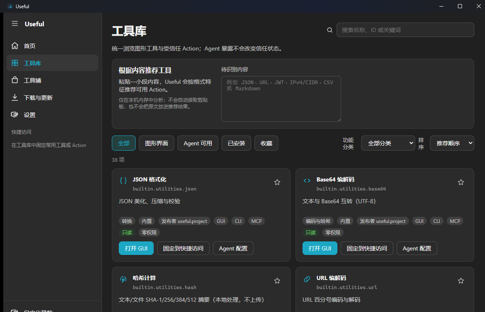
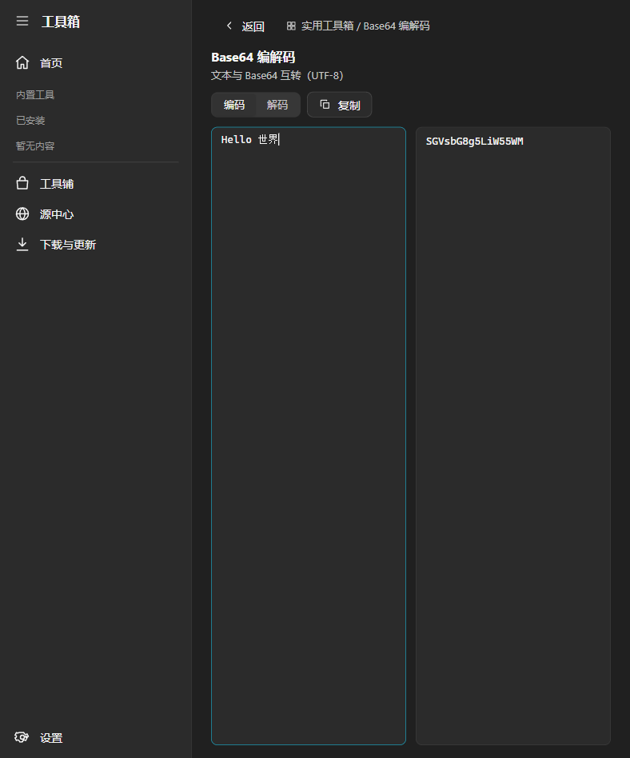
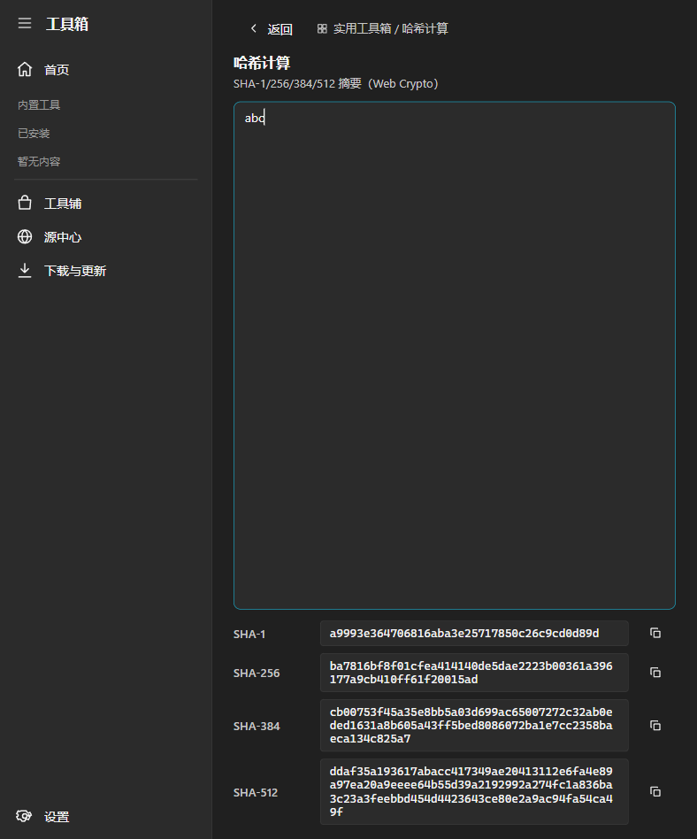

# Useful

简体中文 · [English](README.md)

Useful 是在本地计算机上运行工具的桌面应用。它把常分散在浏览器标签页、命令片段和零散小程序里的
任务集中到一处。

Useful 包含：

- 31 个独立开发实用工具（含 Office 分组共 36 个内置 Action）
- 有固定边界的本地 Office 文件处理
- 视频裁剪与转码
- Windows 进程观测
- 可签名的第三方工具包格式

技术栈：Vue 3、Tauri 2、Rust。

除非功能明确要求联网，工具输入留在本机。Useful 不包含 AI 模型。Useful 不修改 Codex、Claude 或
其他 Agent 宿主的配置。

> [!IMPORTANT]
> Useful 是开发者预览版。官方**签名**安装包和生产更新源尚不可用。未签名的 Windows 桌面预览包已在
> [v0.1.0-beta.6](https://github.com/RedeatI/useful/releases/tag/v0.1.0-beta.6) 发布（推荐便携 zip）。
> Windows 是主要开发平台。部分原生功能在 macOS 或 Linux 上不可用。阅读
> [已知限制](docs/KNOWN-LIMITATIONS.md)。

## 按你的目标开始

| 你想要…… | 从这里开始 |
| --- | --- |
| 试用 Windows 桌面应用 | [下载未签名预览版](#下载未签名-windows-预览) |
| 连接 Agent 宿主 | [CLI 与 MCP](#cli-与-mcp) |
| 构建第三方工具 | [Agent 工具构建指南](docs/agent/BUILD-A-TOOL.md) |
| 构建 Useful 或参与贡献 | [从源码运行](#从源码运行) · [贡献指南](CONTRIBUTING.md) |


### 界面截图

| 工具库 | Base64 | 哈希 |
| --- | --- | --- |
|  |  |  |


### 下载（未签名 Windows 预览）

发布页：[v0.1.0-beta.6](https://github.com/RedeatI/useful/releases/tag/v0.1.0-beta.6)

**首选：便携 zip**

1. 下载 `Useful-0.1.0-beta.6-windows-x64-portable-lite.zip`
2. 解压
3. 打开内层文件夹 `Useful`
4. 运行 `Useful.exe`（保留旁边的 `portable.flag`）
5. 数据目录为 `Useful\data\`

可选：`Useful-0.1.0-beta.6-windows-x64-setup-lite.exe`。
可能出现 SmartScreen 警告。当前**不是** Authenticode 签名的生产包。

请同时下载发布页中的 `SHA256SUMS.txt`，校验便携包：

```powershell
$asset = "Useful-0.1.0-beta.6-windows-x64-portable-lite.zip"
$expected = ((Select-String -Path .\SHA256SUMS.txt -Pattern ([regex]::Escape($asset) + '$')).Line -split '\s+')[0].ToLowerInvariant()
$actual = (Get-FileHash ".\$asset" -Algorithm SHA256).Hash.ToLowerInvariant()
if ($actual -ne $expected) { throw "$asset 的 SHA-256 不匹配" }
```

可复现的问题请提交到 [GitHub Issues](https://github.com/RedeatI/useful/issues)。安全漏洞请按
[SECURITY.md](SECURITY.md) 说明私下报告，不要创建公开 Issue。


## 功能

- **实用工具** — 格式化 JSON。编解码 Base64 与 URL。计算哈希。生成 UUID 与时间戳。测试正则。
  转换 JSON 与 YAML。对比文本。检查 IPv4/CIDR。换算单位。处理颜色。这些工具默认离线可用。
- **Office 文件** — 创建、检查、提取 DOCX 与 PPTX。在简单 Markdown 与文档或幻灯片之间转换。
  检查并转换 XLSX、CSV 与简单 Markdown 表格。检查、合并、拆分、提取、删除、重排、旋转 PDF
  页面，或清理 PDF 元数据。这些工具不是完整的 Office 编辑器。
- **视频** — 检查媒体信息。在格式允许时不重新编码地裁剪。按时间范围转码。提取音频。取消长任务。
- **进程监视器（Windows）** — 显示 CPU、内存、磁盘、GPU 与网络使用情况。首发版本为只读。结束
  进程与一键提权已禁用。若需要管理员权限，先退出 Useful，再从 Windows 以管理员身份启动。
- **工具库** — 搜索、固定并收藏内置工具与已安装工具。
- **扩展** — 校验并打包 Web 工具为 `.useful` 归档，在受信任安装中验证工具发布者的软件包签名。
  这与 Windows 应用本身是否具有 Authenticode 签名是两件事。可自托管兼容的软件源。
- **Agent 访问** — 通过 JSON 命令行接口（CLI）或本地 stdio 的 Model Context Protocol（MCP）
  服务器调用 36 个内置 Action。可用 Agent profile 隐藏宿主不应看到的 Action。

界面支持简体中文与 English (US)。提供浅色与深色主题。

在 Windows 上，若 `Useful.exe` 旁存在 `portable.flag`，便携模式把数据写入 `./data`。否则数据写入
`%APPDATA%\Useful`。需要便携布局时请勿删除 `portable.flag`。

## 从源码运行

安装：

- Node.js `^20.9.0` 或 `>=22.0.0`
- pnpm 9.15.0
- 稳定版 Rust 工具链
- 当前平台的 [Tauri 2 系统依赖](https://v2.tauri.app/start/prerequisites/)

然后执行：

```console
git clone https://github.com/RedeatI/useful.git
cd useful
pnpm install --frozen-lockfile
pnpm tauri dev
```

`pnpm dev` 只启动 Web 前端。用于界面开发。媒体、进程等原生功能需要 Tauri 应用。纯 Web 模式下，
Useful 会报告原生后端不可用。

缺少生产更新信任配置时，release profile 构建会停止。本地 release 风格的质量保证（QA）构建见
[开发者预览说明](docs/DEVELOPER-PREVIEW.md)。不要把这些 QA 文件当作官方二进制发布。

## CLI 与 MCP

默认 Action 注册表包含 **36 个 Action**：

- [工具 Action](docs/TOOL-ACTIONS.md) 中的 31 个实用工具
- 以下 5 组 Office Action：

```text
builtin.office.docx
builtin.office.pptx
builtin.office.spreadsheet
builtin.office.pdf
builtin.office.markdown
```

查询注册表。不要硬编码 Action ID：

```console
node packages/useful-runtime/bin/useful-runtime.mjs actions search --query office --category office --json
node packages/useful-runtime/bin/useful-runtime.mjs actions describe builtin.office.docx --json
node packages/useful-runtime/bin/useful-runtime.mjs actions suggest --input @sample.txt --limit 5 --json
node packages/useful-runtime/bin/useful-runtime.mjs actions recipe --input @examples/action-recipes/json-base64.json --output json
```

显示机器可读的 CLI 契约：

```console
pnpm useful -- agent-contract --json
```

### 连接 Agent 宿主（仅供审阅）

生成针对宿主的 MCP stdio 配置候选。这些命令不写入宿主配置文件：

```console
pnpm useful -- agent plan --target codex --launcher /ABS/PATH/useful-mcp.mjs --json
pnpm useful -- agent export --target claude-code --launcher /ABS/PATH/useful-mcp.mjs --json
pnpm useful -- agent doctor --target claude-desktop --launcher /ABS/PATH/useful-mcp.mjs --json
```

有效 target：`codex`、`claude-code`、`claude-desktop`、`mcp-servers-json`。

运行本机自检，或将候选绑定到当前安装：

```console
pnpm useful -- agent probe --json
pnpm useful -- agent verify --target codex --launcher /ABS/PATH/packages/useful-mcp/bin/useful-mcp.mjs --json
pnpm useful -- agent verify-all --launcher /ABS/PATH/packages/useful-mcp/bin/useful-mcp.mjs --json
```

若使用 GitHub Release 中的 Agent Kit，先解压，再执行：

```console
# Windows
C:\ABS\KIT\bin\useful.cmd agent verify-all --launcher C:\ABS\KIT\lib\useful-mcp.mjs --json

# macOS / Linux
/ABS/KIT/bin/useful agent verify-all --launcher /ABS/KIT/lib/useful-mcp.mjs --json
```

在设置中打开 **Agent Connections**。只粘贴你在终端用 `verify-all` 生成的 JSON。该页面不启动子
进程。该页面不改写宿主配置。

### 这些命令的限制

- 命令不写入 Codex、Claude 或 Claude Desktop 配置文件。
- 命令不安装这些宿主。
- 命令不证明宿主已安装，也不证明宿主会接受该候选。
- `probe`、`verify`、`verify-all` 的结果描述当前进程与本地路径。解析成功只检查结构。它不是签名
  校验。它不是发布声明。
- `computer-use probe` 只检查已禁用的 Computer Use 合同与 adapter 接口。它不控制桌面。它不启动
  浏览器。它不注册 Action 或 MCP 工具。见 [Computer Use](docs/COMPUTER-USE.md)。

`packages/useful-runtime` 与 `packages/useful-mcp` 使用同一注册表。两者都需要 Node.js。它们不是
已发布的独立二进制。

MCP 还注册 4 个 helper：`useful.actions.search`、`useful.actions.describe`、
`useful.actions.suggest`、`useful.actions.recipe`。默认 MCP `tools/list` 返回 **40 项工具**
（36 个 Action + 4 个 helper）。

推荐功能只检查调用方提供的文本。上限为本地内存中 64 KiB。推荐功能不读取剪贴板。

recipe 使用闭集格式 `useful.action-recipe.v1`。recipe 最多 16 步。步骤使用 JSON Pointer 连接。
步骤只调用当前 profile 暴露的只读 Action。示例：
[Action recipe 示例](examples/action-recipes/README.md)。

Office Action 在有大小上限的 JSON 中以 Base64 发送文件字节。Office Action 在运行时可被停止的本地
worker 中执行。Office Action 拒绝任意文件路径。Office Action 不联网。Office Action 不执行宏、
公式、嵌入脚本或外部关系。

媒体与进程 Action 是可选的。用 `--host-config` 加载。它们不属于默认 36 个 Action。破坏性 CLI
调用必须在该次调用上传入 `--confirm`。MCP 只授予已配置的只读 host 项。

更多说明：[AI 接入说明](docs/AI-INTEGRATION.md)。

构建第三方工具：按 [Agent 工具构建指南](docs/agent/BUILD-A-TOOL.md) 操作。

软件源、签名与自托管：阅读 [开发者指南](docs/DEVELOPER-GUIDE.md)。

> **文档语言：** 多数技术文档为中文。英文入口页：
> [Known limitations](docs/KNOWN-LIMITATIONS.en.md)、
> [Developer preview](docs/DEVELOPER-PREVIEW.en.md)、
> [AI Integration](docs/AI-INTEGRATION.en.md)、
> [Tool Actions](docs/TOOL-ACTIONS.en.md)、
> [Plugin SDK](docs/PLUGIN_SDK.en.md)、
> [Developer guide](docs/DEVELOPER-GUIDE.en.md)、
> [Utilities architecture](docs/UTILITIES-ARCHITECTURE.en.md)、
> [Agent tool guide](docs/agent/BUILD-A-TOOL.en.md)、
> [Computer Use](docs/COMPUTER-USE.en.md)、
> [Security assurance](docs/SECURITY-ASSURANCE.en.md)、
> [Language map](docs/README-I18N.md)、
> [Contributing](CONTRIBUTING.md)、
> [Security policy](SECURITY.md)。

## 仓库结构

```text
apps/useful/                   Vue 前端与 Tauri 桌面宿主
crates/useful-*/               Rust 核心、媒体、进程与信任代码
packages/useful-sdk/           Web 工具 SDK
packages/useful-cli/           创建、校验、打包与软件源 CLI
packages/agent-integrations/   Codex/Claude/MCP 配置计划与只读 doctor
packages/computer-use-contract/ Computer Use 合同（默认禁用）
packages/action-runtime/       共享 Action 注册表、契约与本地 handler
packages/useful-runtime/       确定性 JSON Action 运行时
packages/useful-mcp/           本地 stdio MCP 服务器
packages/office-core/          DOCX、PPTX、XLSX/CSV、Markdown 与 PDF 核心
packages/host-actions/         可选原生 host 契约（不在默认注册表中）
services/                      可自托管的软件源服务
repositories/                  静态源示例与测试夹具
examples/                      第三方工具示例
docs/                          架构、接入、安全与发布说明
```

若要修改协议边界，从下列之一开始：

- [实用工具架构](docs/UTILITIES-ARCHITECTURE.md)
- [工具 Action](docs/TOOL-ACTIONS.md)
- [插件 SDK](docs/PLUGIN_SDK.md)

## 开发

在仓库根目录执行：

```console
pnpm lint
pnpm typecheck
pnpm test
cargo fmt --all -- --check
cargo clippy --workspace --all-targets -- -D warnings
cargo test --workspace
pnpm workflow:check
pnpm release:checks
```

修改代码或公开协议前，阅读 [CONTRIBUTING.md](CONTRIBUTING.md)（英文）与 [AGENTS.md](AGENTS.md)。

发布维护者还必须遵循 [开源发布清单](docs/OPEN-SOURCE-RELEASE.md)。

## 安全与许可证

按 [SECURITY.md](SECURITY.md)（英文）报告漏洞。

扩展包与 Action 的信任规则见 [安全保证](docs/SECURITY-ASSURANCE.md)。

本仓库使用多种许可证。[LICENSE](LICENSE) 与 [LICENSES.md](LICENSES.md) 列出 Owner 已确认的组件
映射。第三方组件保留其原许可证。另见 [第三方声明](THIRD_PARTY_NOTICES.md) 与
[商标政策](TRADEMARKS.md)。
